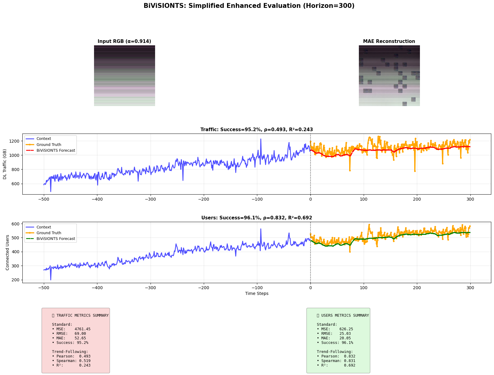
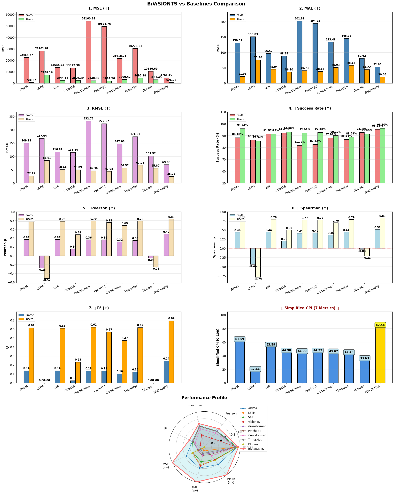
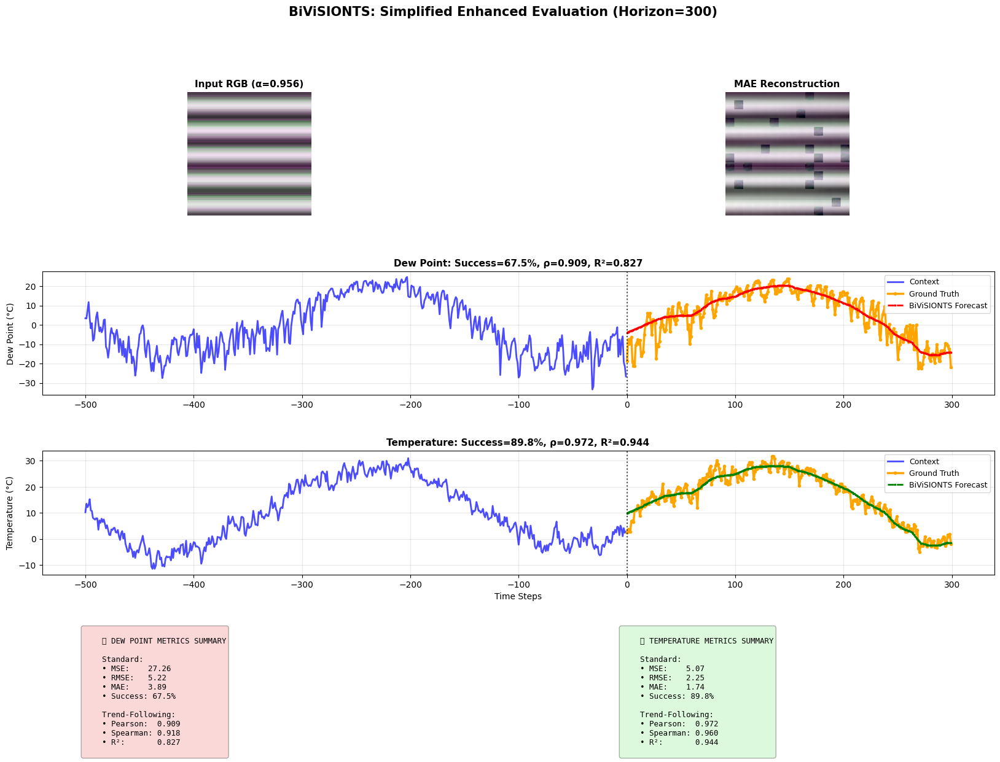
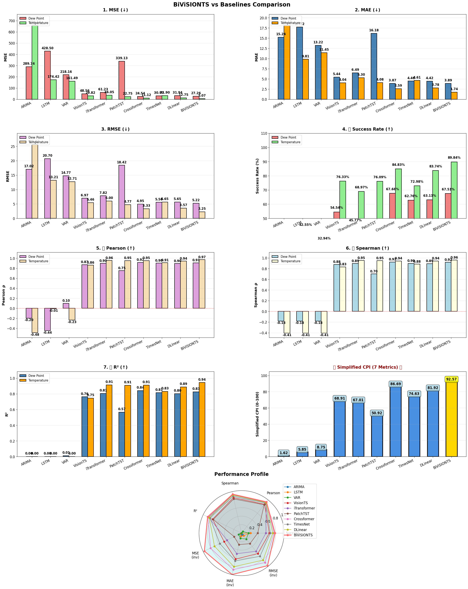

# BiViSIONTS: Bivariate Vision Transformer for Time Series Forecasting

**What if a neural network could forecast network traffic by *looking at it* — literally, as a picture?**

BiViSIONTS (Bivariate Vision Transformer for Time Series) is a forecasting framework that turns two correlated time series into a single color image and asks a pretrained computer-vision model to "complete the picture" — where the completed region *is* the forecast. It requires **no training whatsoever**: the vision backbone stays frozen with its original ImageNet weights, yet it outperforms both classical statistical methods and state-of-the-art deep learning forecasters that were trained specifically on the target data.

This is the research repository for an MSc thesis project (University of Moratuwa, in collaboration with Dialog Axiata PLC), where the method was developed for telecommunications capacity planning and validated on real network data plus a public environmental dataset. The full thesis is available as [`BiViSIONTS Thesis.pdf`](BiViSIONTS%20Thesis.pdf).

---

## The Problem

Telecom operators need to forecast network demand months ahead — how much data traffic a cell site will carry, how many users will connect — to plan capacity upgrades that have 6–9 month lead times. These two quantities are not independent: traffic and users move together, with a correlation that is strong but *changes depending on the time scale you look at*. In the Dialog Axiata data, the correlation is 0.77 over the last 150 days, 0.82 over 400 days, and a near-perfect 0.98 over the full history. Recent patterns diverge (promotions, congestion, special events); long-term trends move in lockstep.

Existing approaches struggle with this setting in different ways:

- **Classical methods** (ARIMA, VAR) are interpretable and cheap, but their linear assumptions collapse over long horizons — on strongly seasonal data they can fail completely.
- **Deep learning forecasters** (LSTM, and modern transformers like PatchTST or iTransformer) are powerful *when there is enough training data*. A single cell site provides ~1,000 daily observations — far too little for architectures designed around benchmarks with tens of thousands of training steps.
- **VisionTS**, a recent breakthrough, showed that a Masked Autoencoder Vision Transformer (MAE-ViT) pretrained only on ImageNet photos can forecast time series *zero-shot* by rendering them as grayscale images. But it is strictly **univariate** — it forecasts each variable in isolation and throws away exactly the cross-variable correlation that makes bivariate data valuable.

BiViSIONTS closes that gap: it keeps VisionTS's zero-shot vision paradigm while making the model *see both variables and their relationship at once*.

---

## The Idea: Two Series, Three Channels

A color image has three channels — red, green, blue. BiViSIONTS gives each one a job:

- 🔴 **Red channel** — variable 1 (e.g. downlink traffic volume), normalized
- 🟢 **Green channel** — variable 2 (e.g. connected users), normalized
- 🔵 **Blue channel** — an **adaptive fusion** of the two, weighted by how correlated they actually are

The fusion weight is not learned by gradient descent — it is *computed directly from the data*. The Pearson correlation ρ between the two series is measured at three temporal scales and converted to attention weights α = (ρ + 1)/2, then blended with a recency bias:

$$\alpha_{\text{final}} = 0.5\,\alpha_{\text{short}} \;+\; 0.3\,\alpha_{\text{medium}} \;+\; 0.2\,\alpha_{\text{long}}$$

Recent behaviour gets the most say (50%), medium-term cycles add context (30%), and the long-term relationship anchors stability (20%). On the telecom data this yields α ≈ 0.914 — the blue channel blends 91.4% traffic with 8.6% users, automatically reflecting the observed dependency structure. Because the weights come from correlations rather than training, the whole mechanism adapts to any new dataset instantly and stays fully interpretable.

The resulting RGB image (history + a masked "future" region) goes through a frozen MAE Vision Transformer, which reconstructs the masked region the same way it learned to in-paint hidden patches of ImageNet photos. The reconstructed pixels are then decoded back into numbers — and that is the forecast, for both variables simultaneously.

  

<em>The full pipeline on telecom data: the RGB-encoded input and its MAE reconstruction (top), and the resulting 300-day forecasts for traffic volume and connected users (middle/bottom), tracking ground truth with ~95–96% accuracy — with zero training.</em>

Ablation studies confirm both design choices earn their keep: multi-scale attention adds **+1.47%** accuracy over using a single global correlation, and the adaptive weighting adds **+0.62%** over a naive fixed 50-50 blend.

---

## What We Found

BiViSIONTS was benchmarked against **nine competitors spanning three paradigms** — classical statistics (ARIMA, VAR), supervised deep learning (LSTM plus five state-of-the-art multivariate architectures: iTransformer, PatchTST, Crossformer, TimesNet, DLinear), and the univariate zero-shot VisionTS — all under an identical protocol on a deliberately hard task: forecasting **300 days ahead** (~10 months). Performance is summarized by a Composite Performance Index (CPI) blending seven metrics: point-wise accuracy (MSE, MAE, RMSE, success rate) *and* trend-following fidelity (Pearson, Spearman, R²).

### Telecom dataset — where data is scarce

  

**BiViSIONTS ranks first (CPI 82.6)**, ahead of ARIMA (61.6), VAR (53.6), and — strikingly — *all five* SOTA multivariate transformers (CPI 33.6–45.0). With only ~275 training windows available from a single cell site, the modern data-hungry architectures could not even beat classical ARIMA. Two baselines tell a cautionary tale visible in the chart's correlation panels: **DLinear** and **LSTM** achieve respectable point-wise accuracy while their forecasts actually move in the *wrong direction* (negative correlations, R² = 0) — a failure mode invisible to error metrics alone, and precisely why the evaluation weighs trend-following as heavily as accuracy.

### Beijing Air Quality dataset — where data is plentiful

To test generalization far outside telecom, the same frozen model forecast dewpoint and temperature 300 days ahead on the public Beijing Air Quality dataset — different domain, different dynamics (smooth annual seasonality instead of promotion-driven demand), and 3.5× more training data for the supervised competitors.

  

<em>Cross-domain, zero-shot: the same frozen ImageNet backbone tracks a full seasonal cycle of Beijing dewpoint and temperature (average correlation 0.94), 300 days out.</em>

Here the classical methods collapsed entirely — ARIMA scored **0% success with negative correlations** — while the supervised transformers, now with enough data, became genuinely strong. And still: **BiViSIONTS ranks first again (CPI 92.6, 78.7% success)**, edging out the best trained competitor, Crossformer (86.7, 76.2%), which needed 138 seconds of task-specific training on 515K parameters to get that close.

  

### Three takeaways

1. **The ranking of trained methods flips between datasets — BiViSIONTS doesn't.** On scarce telecom data, classical ARIMA beats every SOTA transformer; on abundant Beijing data, the transformers crush the classics. Which supervised method to trust depends on data volume and pattern regularity you can't know in advance. The zero-shot approach ranked first in *both* regimes without touching a single weight.
2. **Cross-variable correlation is the signal that matters.** On both datasets, the strongest supervised competitor was Crossformer — the only baseline with explicit cross-variable attention. Independent architectures arrived at the same conclusion BiViSIONTS is built on: modeling the relationship between the variables is what improves bivariate forecasts.
3. **Zero training is an operational superpower.** A telecom operator runs thousands of cell sites. Supervised methods would need per-site training and periodic retraining; BiViSIONTS forecasts a new site in seconds with the same frozen weights, with reproducible stability (σ < 1.21% across 1,000 randomized runs).

---

## Why It Matters

For **telecommunications**, a 10-month forecast horizon with ~96% accuracy and reliable trend direction directly supports annual planning cycles, capacity commit-to-build decisions with long procurement lead times, and anomaly detection (persistent deviation from forecast signals structural change). The same recipe applies to any pair of correlated series with ρ > 0.5 — energy demand and temperature, hospital admissions and resource utilization, sales and foot traffic.

For **research**, BiViSIONTS demonstrates that visual representations learned from natural photographs transfer to *multivariate temporal* structure — extending the pixels-to-predictions paradigm beyond single variables — and that carefully designed, data-driven attention can substitute for learned parameters entirely, keeping the system interpretable end to end: every weight in the fusion can be traced back to a measurable correlation.

---

## Limitations & What's Next

The RGB design naturally caps the method at **two variables**; extending to N > 2 will need richer encodings (3D convolutions, graph structures, or hyperspectral-style channels). The multi-scale weights (0.5/0.3/0.2) are fixed heuristics that could be made learnable and horizon-adaptive. And the backbone is still ImageNet-pretrained — pretraining an MAE on large time-series-as-image corpora is a promising direction. Sudden regime shifts (infrastructure upgrades, market shocks) that break the historical correlation structure remain the main deployment risk, mitigated by periodic recalibration.

---

## Learn More

- 📖 **Full thesis** — methodology, 216-configuration hyperparameter study, 1,000-iteration convergence analysis, complete ablation and baseline chapters: [`BiViSIONTS Thesis.pdf`](BiViSIONTS%20Thesis.pdf)
- 📓 **Research notebooks** — end-to-end reproducible pipelines: `BiViSIONTS_INFO.ipynb` (telecom) and `BiViSIONTS_INFO_DATASET2.ipynb` (Beijing Air Quality)
- 🖼️ **All result figures**: [`thesis_figures/`](thesis_figures/)

## Acknowledgements

Built on [VisionTS](https://github.com/Keytoyze/VisionTS) (Chen et al.) and the [MAE](https://github.com/facebookresearch/mae) pretrained weights (He et al.); SOTA baseline implementations from the [Time-Series-Library](https://github.com/thuml/Time-Series-Library) (THUML). Telecom data and domain validation courtesy of **Dialog Axiata PLC**. Thesis by **H. K. S. N. Heendeniya**, supervised by **Dr. Thanuja Ambegoda**, Department of Computer Science & Engineering, University of Moratuwa.

## License

MIT — see [`LICENSE`](LICENSE).
